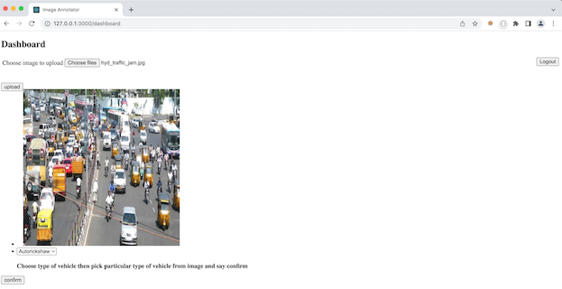

# README #

Image Annotation to web app which process img based on annotation
Step - Upload image's input file


### Image Annotation Back End Service ###

* Provide Image Annotation
* 0.0.1
* [Learn Markdown](https://bitbucket.org/tutorials/markdowndemo)

### Tech Versions ###

* [Python3.6] backend service
* [Reactjs] img-ann-client client
* [DB] mongo db with collection name `image_storage`
* [Docker] for deployment
* [Make] for build

### How do I get set up? ###

* Clone Repo
* Setup mongo DB and set env variables DB_USER, DB_USER_PWD, DB_NAME, DB_HOST
* Install requirement.txt dependencies ```python -m pip install -r requirements.txt```
* ``make run`` command to run service
* http://127.0.0.1:5000

### Deployment ? ###
* It support docker deployment
* Chmod +x deployment.sh
* RUN ./deployment.sh
* http://127.0.0.1:5000/docs  [API Documents]
